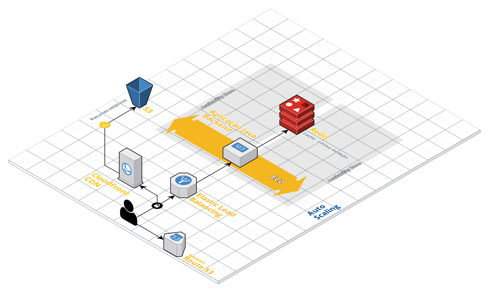
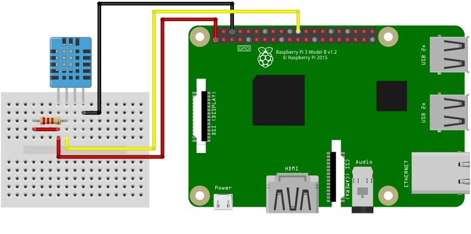

# Demo de aplicação com conexão via web-socket

Esse serviço recebe medição de temperatura e humidade pelo endpoint "/listener" e o publica em tópico websocket. Uma tela em javascript, conectada ao websocket, mostra os valores recebidos.

O front-end é atualizado automaticamente a cada medição.

Cada amostra medida é gravada no Redis; quando um usuário abre o front-end, a última medição é obtida.

## Front-end rodando na AWS
http://ec2-3-88-52-204.compute-1.amazonaws.com:9052/

## Documentação da API rodando na AWS
http://ec2-3-88-52-204.compute-1.amazonaws.com:9052/swagger-ui.html

## Arquitetura cloud AWS - IaaS

- Jenkins roda em uma instância EC2:
http://ec2-3-88-52-204.compute-1.amazonaws.com:8080

- Pipeline baixa fontes do github, faz o build e sobe container docker, também em instância EC2.

## Leitura de temperatura e humidade

A temperatura e humidade é registrada por meio de um programa Python que roda em um Raspberry Pi. 
O programa lê os dados por meio de um sensor DHT11:

O programa se encontra no diretório "python", e foi adaptado a partir da referência:
https://www.filipeflop.com/blog/temperatura-umidade-dht11-com-raspberry-pi/

